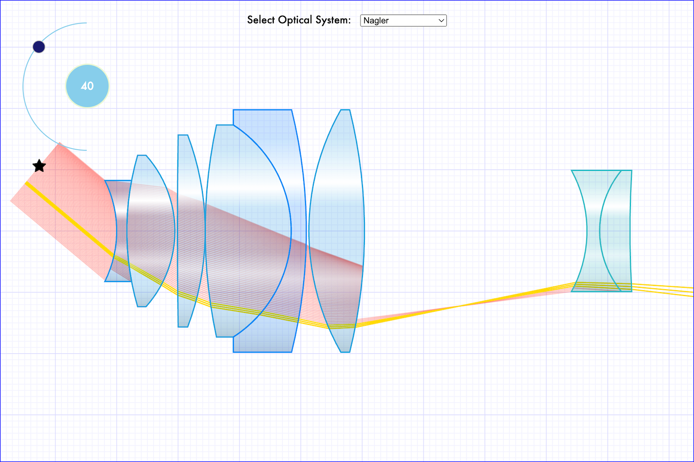

  

    
  

# Optics Canvas

The Optics Canvas is a web based utility for displaying and simulating optical systems and the refraction of light through them.  It uses the "canvas" element to display high performance interative optical systems.

Double Gauss

Achromat

Fisheye

Nagler

# License

Distributed under the MIT license which allows urestricted use of the software. See [LICENSE.txt](LICENSE.txt) for more information.

<!-- CONTACT -->

# Contact

Abe Megahed - (mailto:amegahed@wisc.edu) - email
